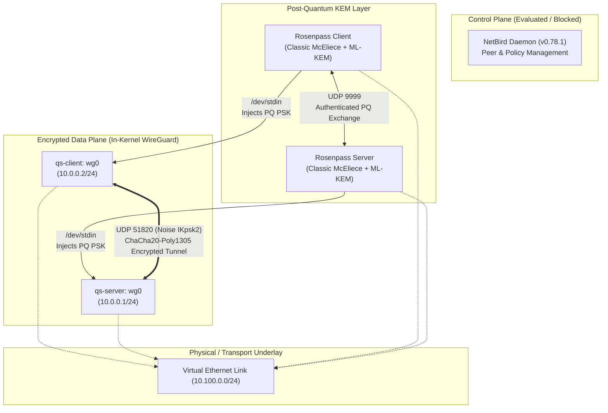

# Q-Shield: Hybrid Post-Quantum Secure Remote-Access VPN

[]()
[](https://www.wireguard.com/)
[](https://rosenpass.eu/)
[](https://netbird.io/)

**Q-Shield** is a hybrid post-quantum VPN prototype combining **WireGuard** with **Rosenpass-derived post-quantum preshared keys**, with **NetBird** evaluated as the management/mesh layer.

The project demonstrates how to protect remote-access VPN tunnels against **Harvest-Now-Decrypt-Later (HNDL)** attacks by quantum adversaries, without abandoning the battle-tested performance and security of in-kernel WireGuard.

---

## Architecture Overview

Q-Shield establishes a strict separation of concerns across three distinct layers:

```text
┌─────────────────────────────────────────────────────────────────────────┐
│ NetBird (Management / Control-Plane Layer)                              │
│   • Peer discovery, overlay routing, access control policies            │
│   • Evaluated in Stage 5 (Interface wt0; blocked pending control plane) │
└─────────────────────────────────────────────────────────────────────────┘
                                   ↓
┌─────────────────────────────────────────────────────────────────────────┐
│ Rosenpass (Post-Quantum Key Exchange Layer)                             │
│   • Authenticated post-quantum KEM: Classic McEliece 460896 + ML-KEM-768│
│   • Negotiates 256-bit symmetric shared secrets over UDP port 9999      │
│   • Dynamically streams PSK into WireGuard via /dev/stdin               │
└─────────────────────────────────────────────────────────────────────────┘
                                   ↓
┌─────────────────────────────────────────────────────────────────────────┐
│ WireGuard (Encrypted Transport / Data-Plane Layer)                      │
│   • In-kernel Linux module operating on wg0                             │
│   • Noise IKpsk2 handshake: Curve25519 (classical ECDH) + PQ PSK        │
│   • Symmetric data encryption: ChaCha20-Poly1305 with BLAKE2s          │
└─────────────────────────────────────────────────────────────────────────┘
```



> [!IMPORTANT]
> **Cryptographic Core Principle**:
> - **WireGuard itself is classical**. It uses Curve25519, ChaCha20-Poly1305, and BLAKE2s.
> - The post-quantum component is introduced **solely** through the **Rosenpass-derived WireGuard Pre-Shared Key (PSK)** within the Noise IKpsk2 handshake pattern.
> - **NetBird is the network-management and mesh layer**. NetBird does not make WireGuard post-quantum on its own; it was evaluated to explore policy and overlay mesh capabilities.

---

## Implementation & Verification Status

The implementation follows a disciplined, stage-gated verification methodology in isolated Linux network namespaces (`qs-server` and `qs-client`).

| Stage | Focus Area | Status | Checks | Key Empirical Result |
| :--- | :--- | :---: | :---: | :--- |
| **Stage 1** | Environment & Tooling Preparation | **PASSED** | 8 / 8 | Verified namespaces, veth transport (10.100.0.0/24), tooling baseline. |
| **Stage 2** | Classical WireGuard Tunnel | **PASSED** | 11 / 11 | In-kernel `wg0` tunnel established; 0.0% packet loss ping reachability. |
| **Stage 3** | Rosenpass PQ Key Exchange Integration | **PASSED** | 14 / 14 | Classic McEliece + ML-KEM PSK injection; mutual PSKs populated. |
| **Stage 4** | Periodic PSK Rotation & Continuity | **PASSED** | 9 / 9 | 1,520 packets at 100ms; **0.0% packet loss** across 27s & 131s rotations. |
| **Stage 5** | NetBird Integration Evaluation | **BLOCKED** | 10 passed<br/>4 blocked | Daemons initialized & Rosenpass detected; `wt0` blocked awaiting setup key. |
| **Stage 6** | Automated Master Test Suite | *Out of Scope* | — | Not implemented; no synthetic test suites created. |
| **Stage 7** | Reproducible Benchmarking Suite | *Out of Scope* | — | Not implemented; no fabricated benchmark numbers. |

### Stage 5 Evaluation Summary (Why it is BLOCKED)

In Stage 5, NetBird v0.78.1 was evaluated inside the isolated network namespaces:
- **What Worked**: NetBird client daemons successfully ran in `qs-server` and `qs-client` via isolated unix sockets. Binary analysis confirmed native Go support for Rosenpass (`github.com/netbirdio/netbird/client/internal/rosenpass`), reporting `Quantum resistance: true`.
- **Why it is BLOCKED**: NetBird is designed as a centrally coordinated overlay. It does not instantiate its TUN interface (`wt0`) or establish peer routes until it registers with a Management Server via a setup key or interactive SSO. Because no external Management Server or setup key was present in the isolated offline environment, peer registration could not proceed.
- **Strict Rigor**: In strict accordance with engineering ethics, no fake credentials or mock peers were fabricated. Stage 5 is honestly documented as **EVALUATED & BLOCKED**, while the underlying WireGuard + Rosenpass post-quantum tunnel remained 100% functional.

---

## Experimental Verification Results

All results are backed by machine-readable JSON logs in `results/`:

### 1. Hybrid Rekeying & Post-Quantum Authentication (Stage 3)
- **Key Exchange Primitives**: Classic McEliece 460896 (code-based KEM) + ML-KEM-768 (lattice-based KEM, FIPS 203).
- **Transport**: UDP port 9999 across `veth` transport link.
- **WireGuard Injection**: Symmetric 256-bit PSK streamed into WireGuard peer table via `/dev/stdin`.
- **Verification**: WireGuard handshake age refreshed to 0s upon exchange; raw PSKs masked as `(hidden)` in `wg show`.

### 2. Tunnel Continuity Under Continuous PSK Rotation (Stage 4)
To test whether periodic post-quantum rekeying disrupts active network sessions, an automated monitor tracked sequential key epochs while transmitting continuous ICMP traffic:

```text
Observation Window:   158 seconds
Epochs Observed:      3 distinct PSK epochs (A -> B -> C)
Rotation Intervals:   27 seconds and 131 seconds (Average: 79.0s)
Packet Transmission:  1,520 ICMP packets (1 packet every 100ms)
Packets Received:     1,520 packets
Packet Loss:          0.0% (Zero packets dropped during key rotation)
RTT Latency:          min = 0.188 ms | avg = 0.536 ms | max = 1.780 ms
```

---

## Reproducible Quickstart

The entire prototype can be spun up and verified in any Linux environment with root/sudo capability (including WSL2 on Windows 11 with kernel 6.x+).

### 1. Prerequisites
```bash
# Verify kernel WireGuard module and required utilities
modprobe wireguard
which wg wg-quick ip jq
```

### 2. Launch Stages 1 through 3
```bash
# Step 1: Create isolated network namespaces (qs-server & qs-client)
sudo ./scripts/setup_namespaces.sh

# Step 2: Establish classical WireGuard tunnel (10.0.0.1 <-> 10.0.0.2)
sudo ./scripts/setup_wireguard_stage2.sh

# Step 3: Start Rosenpass post-quantum key exchange & PSK injection
sudo ./scripts/setup_rosenpass_stage3.sh
```

### 3. Run Verification Suites
```bash
# Verify post-quantum tunnel and PSK installation (14 tests)
sudo ./scripts/verify_stage3.sh

# Verify PSK rotation observability & tunnel continuity (9 tests)
sudo ./scripts/verify_stage4.sh

# Evaluate NetBird stage 5 integration status (14 tests)
sudo ./scripts/verify_stage5.sh
```

### 4. Clean Teardown
```bash
# Cleanly tear down NetBird daemons (reverts to Stage 3/4 baseline)
sudo ./scripts/teardown_netbird_stage5.sh

# Cleanly tear down Rosenpass (reverts to Stage 2 classical tunnel)
sudo ./scripts/teardown_rosenpass_stage3.sh

# Cleanly tear down WireGuard interfaces
sudo ./scripts/teardown_wireguard_stage2.sh

# Remove network namespaces and virtual links
sudo ./scripts/teardown_namespaces.sh
```

---

## Project Structure

```text
Q-Shield/
├── bin/                       # Local execution binaries (netbird, rosenpass, rp)
├── config/                    # Configuration files (.gitkeep)
├── docs/                      # In-depth architectural & security documentation
│   ├── ARCHITECTURE.md        # Deep architectural design, component breakdown & diagrams
│   ├── THREAT_MODEL.md        # RFC 3552 / STRIDE threat model & cryptographic assumptions
│   ├── TROUBLESHOOTING.md     # Diagnostic runbook for namespaces, WireGuard & Rosenpass
│   ├── STAGE1.md              # Stage 1 environment validation report
│   ├── STAGE2.md              # Stage 2 classical WireGuard report
│   ├── STAGE3.md              # Stage 3 Rosenpass post-quantum integration report
│   ├── STAGE4.md              # Stage 4 PSK rotation & continuity report
│   └── STAGE5.md              # Stage 5 NetBird evaluation report
├── results/                   # Machine-readable verification results
│   ├── stage1_results.json    # Stage 1 verification output
│   ├── stage2_results.json    # Stage 2 verification output
│   ├── stage3_results.json    # Stage 3 verification output
│   ├── stage4_results.json    # Stage 4 rotation & continuity metrics
│   └── stage5_results.json    # Stage 5 NetBird evaluation output
├── scripts/                   # Reversible setup, teardown, and verification scripts
│   ├── setup_namespaces.sh
│   ├── teardown_namespaces.sh
│   ├── verify_stage1.sh
│   ├── setup_wireguard_stage2.sh
│   ├── teardown_wireguard_stage2.sh
│   ├── verify_stage2.sh
│   ├── setup_rosenpass_stage3.sh
│   ├── teardown_rosenpass_stage3.sh
│   ├── verify_stage3.sh
│   ├── monitor_psk_rotation.sh
│   ├── test_psk_rotation.sh
│   ├── test_rotation_continuity.sh
│   ├── verify_stage4.sh
│   ├── setup_netbird_stage5.sh
│   ├── teardown_netbird_stage5.sh
│   └── verify_stage5.sh
├── tests/                     # Test directory (.gitkeep)
├── benchmarks/                # Benchmark directory (.gitkeep)
└── .gitignore                 # Strict secret & runtime artifact exclusion rules
```

---

## Technologies & Cryptographic Standards

- **In-Kernel WireGuard**: Linux kernel module implementation of the Noise protocol framework.
- **Rosenpass (v0.2.3)**: Post-quantum authenticated key exchange daemon written in Rust and C (liboqs).
  - **Classic McEliece 460896**: Conservative code-based KEM with over 45 years of cryptanalytic scrutiny.
  - **ML-KEM-768**: NIST FIPS 203 standardized module lattice-based KEM (formerly Kyber-768).
  - **Noise IKpsk2**: Hybrid composition mixing ephemeral Curve25519 ECDH with the Rosenpass-derived 256-bit PSK.
- **NetBird (v0.78.1)**: Open-source overlay mesh network manager written in Go.
- **Linux Network Namespaces (`ip netns`)**: Kernel-level network stack virtualization ensuring complete isolation from host routing.

---

## Security & Operational Principles

1. **Defense-in-Depth Hybrid Design**:
   The hybrid construction combines classical Diffie-Hellman (Curve25519) with post-quantum KEMs (Classic McEliece and ML-KEM). Under the Noise IKpsk2 protocol composition, an adversary must break both the classical discrete logarithm assumption and the post-quantum lattice/code assumptions to decrypt intercepted sessions.
2. **Zero-Leakage Key Handling**:
   - Rosenpass streams negotiated keys directly into WireGuard via `/dev/stdin`. Pre-shared keys are never written to disk or logged.
   - All secret files (`*.pqsk`, `*.key`) are stored outside git with `0600` permissions.
   - In-flight monitoring computes non-secret SHA-256 fingerprints in memory to verify peer convergence without revealing the underlying secrets.
3. **No Routing Hijacking**:
   All networking operations take place inside isolated namespaces (`qs-server` and `qs-client`). The Windows host routing table and external network adapters are never modified.

---

## Limitations

- **Prototype Scope**: The validated data plane operates across point-to-point network namespaces connected by virtual ethernet. It is not currently deployed across public internet infrastructure.
- **Control Plane Dependency**: Dynamic mesh overlay and access control policies require a running NetBird Management Server (cloud or self-hosted) and setup keys.
- **Rosenpass Key Rotation Control**: Standalone Rosenpass 0.2.3 enforces internal protocol rotation timers (~120 seconds); custom rotation periods cannot be overridden via CLI flags.

---

## Future Work (Planned)

- [ ] **Self-Hosted NetBird Management Plane**: Deploy a lightweight, local NetBird management container to unblock Stage 5 mesh peer registration and ACL policy enforcement.
- [ ] **Automated Performance Benchmarking**: Implement reproducible `iperf3` throughput and latency testing comparing classical WireGuard against the hybrid post-quantum tunnel.
- [ ] **Automated Packaging & Systemd Units**: Package Q-Shield as portable systemd services for automated startup and failover recovery.