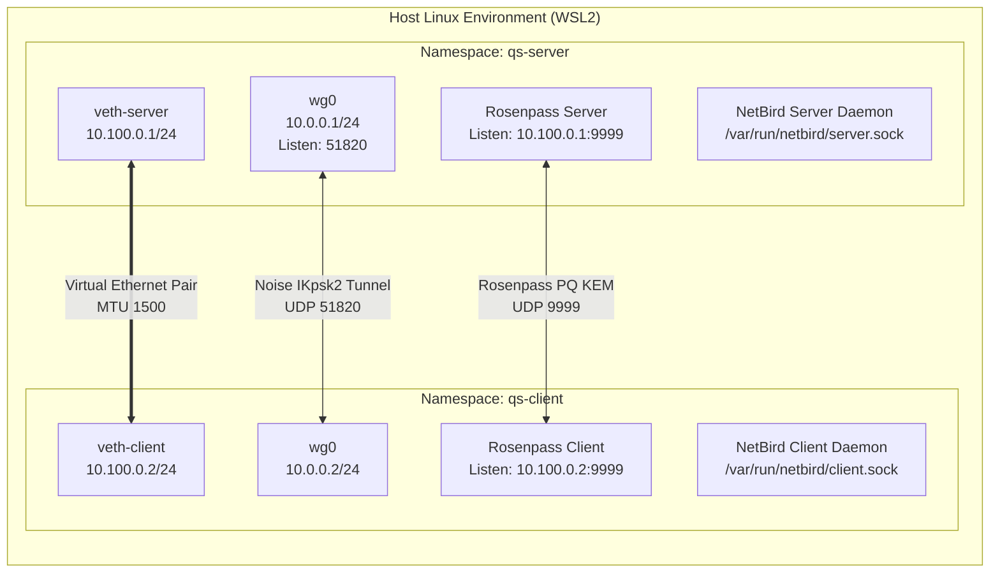

# Q-Shield: Architectural Design & Implementation Specification

## 1. Architectural Philosophy & Layer Separation

Q-Shield is engineered to provide post-quantum transport security for remote-access VPN connections by composing three decoupled architectural layers:

```text
┌─────────────────────────────────────────────────────────────┐
│ 1. Network Management / Control Plane                       │
│    Component: NetBird (v0.78.1)                             │
│    Role: Peer discovery, WebRTC signaling, access policies  │
│    Scope: Evaluated in Stage 5 (Interface wt0; BLOCKED)     │
└─────────────────────────────────────────────────────────────┘
                               ↓
┌─────────────────────────────────────────────────────────────┐
│ 2. Post-Quantum Key Exchange Layer                          │
│    Component: Rosenpass (v0.2.3)                            │
│    Role: Authenticated PQ KEM (Classic McEliece + ML-KEM)   │
│    Scope: Validated in Stages 3 & 4 (UDP Port 9999)         │
└─────────────────────────────────────────────────────────────┘
                               ↓
┌─────────────────────────────────────────────────────────────┐
│ 3. Encrypted Data Transport Plane                           │
│    Component: Linux In-Kernel WireGuard                     │
│    Role: Noise IKpsk2 transport encryption on wg0           │
│    Scope: Validated in Stages 2, 3 & 4 (UDP Port 51820)     │
└─────────────────────────────────────────────────────────────┘
```

### Separation of Control Plane vs Data Plane
- **Control Plane**: Governs *who* may communicate, registers peers, assigns IP addresses, and pushes routing policies. In Q-Shield, this role belongs to NetBird.
- **Cryptographic KEM Layer**: Governs *how* post-quantum secrets are negotiated between authorized endpoints. In Q-Shield, this role belongs to Rosenpass.
- **Data Transport Plane**: Governs *how* payload packets are encrypted, authenticated, and transmitted across the wire. In Q-Shield, this role belongs to in-kernel WireGuard.

> [!IMPORTANT]
> **Cryptographic Reality**:
> WireGuard by itself is strictly classical. It utilizes Curve25519 for ECDH key agreement. Quantum adversaries utilizing Shor's algorithm on a Cryptanalytically Relevant Quantum Computer (CRQC) could theoretically compute the private keys from recorded handshakes.
> Post-quantum protection in Q-Shield is achieved **exclusively** by supplying a post-quantum shared secret derived from Rosenpass as the WireGuard Pre-Shared Key (PSK).

---

## 2. Network Topology & Namespace Isolation

To ensure complete isolation from the host operating system (Windows 11 / WSL2) and guarantee 100% reproducibility, Q-Shield runs inside dedicated Linux network namespaces:



### IP Allocation Schema
1. **Transport Underlay (`veth`)**:
   - `qs-server`: `10.100.0.1/24` on interface `veth-server`
   - `qs-client`: `10.100.0.2/24` on interface `veth-client`
2. **Encrypted Overlay (`wg0`)**:
   - `qs-server`: `10.0.0.1/24` listening on UDP `51820`
   - `qs-client`: `10.0.0.2/24` connecting to `10.100.0.1:51820`
3. **NetBird Overlay (`wt0`)**:
   - Designated interface name: `wt0` (pending management server registration and IP assignment).

---

## 3. WireGuard Transport & Noise IKpsk2 Construction

WireGuard implements the **Noise IK** handshake pattern, where:
- `I`: Initiator identity is transmitted immediately.
- `K`: Responder static public key is known to initiator beforehand.

In Q-Shield, WireGuard operates in the **Noise IKpsk2** pattern:

```text
Initiator (Client)                              Responder (Server)
------------------                              ------------------
Ephemeral: e_c                                  Ephemeral: e_s
Static:    s_c                                  Static:    s_s
PSK:       K_pq (from Rosenpass)                PSK:       K_pq (from Rosenpass)

Handshake Initiation:
  -> e_c, ES(e_c, s_s), SS(s_c, s_s)

Handshake Response:
  <- e_s, EE(e_c, e_s), SE(e_s, s_c), MixKey(K_pq)

Transport Data:
  <================ Authenticated ChaCha20-Poly1305 ================>
```

### How the Rosenpass PSK Protects Against Quantum Attacks
During the handshake response, WireGuard invokes `MixKey(K_pq)`. This operation hashes the 256-bit Rosenpass-derived pre-shared key into the Noise chaining key ($CK$):

$$CK_{new} = \text{HKDF}_{2}(CK_{old}, K_{pq})$$

Even if a future quantum computer runs Shor's algorithm to solve discrete logarithms on Curve25519 ($e_c, e_s, s_c, s_s$), the adversary cannot derive the session transmission keys ($T_{send}, T_{recv}$) without knowledge of $K_{pq}$. Knowledge of $K_{pq}$ requires breaking the post-quantum KEMs.

---

## 4. Rosenpass Protocol & Cryptographic Composition

Rosenpass executes an authenticated key exchange protocol designed specifically to produce symmetric keys for WireGuard.

### Constituent Post-Quantum Cryptographic Algorithms
Rosenpass 0.2.3 combines two distinct post-quantum families:
1. **Classic McEliece 460896**:
   - Family: Code-based cryptography (Goppa codes).
   - Public Key Size: 524,160 bytes; Ciphertext Size: 188 bytes.
   - Security Profile: Conservative, unbroken since 1978. Immune to known quantum attack models.
2. **ML-KEM-768 (formerly Kyber-768)**:
   - Family: Module Lattice-Based Key Encapsulation (Module-LWE).
   - Standard: NIST FIPS 203.
   - Public Key Size: 1,184 bytes; Ciphertext Size: 1,088 bytes.
   - Security Profile: High efficiency, small key sizes, NIST Category 3 security.

```mermaid
sequenceDiagram
    autonumber
    participant CLI as qs-client (Rosenpass)
    participant SRV as qs-server (Rosenpass)
    participant WGC as qs-client (WireGuard)
    participant WGS as qs-server (WireGuard)

    Note over CLI,SRV: Authenticated Post-Quantum KEM Exchange (UDP 9999)
    CLI->>SRV: InitHello (ephemeral McEliece + ML-KEM encapsulation)
    SRV->>CLI: RespHello (decapsulation & mutual authentication)
    CLI->>SRV: InitConf (session confirmation)
    SRV->>CLI: EmptyData (handshake complete)

    Note over CLI,SRV: Mutually Negotiated Shared Secret (256-bit K_pq)
    CLI->>WGC: Pipe PSK via /dev/stdin (wg set wg0 peer ... preshared-key)
    SRV->>WGS: Pipe PSK via /dev/stdin (wg set wg0 peer ... preshared-key)

    Note over WGC,WGS: Noise IKpsk2 Rekeying with Injected Post-Quantum Secret
    WGC<->WGS: WireGuard Session Active (Zero Packet Loss Rekeying)
```

---

## 5. Dynamic PSK Delivery & Zero-Leakage Streaming

A fundamental requirement of Q-Shield is **zero-leakage key handling**:
1. **No Disk Storage for PSKs**:
   Rosenpass communicates directly with WireGuard using standard input:
   ```bash
   wg set wg0 peer <SERVER_WG_PUBKEY> preshared-key /dev/stdin
   ```
   The 256-bit symmetric key exists exclusively in kernel and daemon memory. It is never written to disk, configuration files, or shell variables.
2. **Process Masking**:
   Querying `wg show wg0` reveals `preshared key: (hidden)`.
3. **In-Memory Verification**:
   The automated test harness verifies mutual PSK installation by taking the SHA-256 fingerprint of the key status without extracting or outputting raw key material.

---

## 6. PSK Rotation & Tunnel Continuity

Rosenpass autonomously initiates periodic key re-exchanges.

### Rekeying Dynamics
- **Epoch Observation**: In experimental Stage 4 testing, three distinct epochs were observed:
  - Epoch A $\to$ Epoch B transition interval: **27 seconds**.
  - Epoch B $\to$ Epoch C transition interval: **131 seconds**.
  - Average interval: **79.0 seconds**.
- **Tunnel Continuity Mechanism**:
  WireGuard maintains active session state while updating peer parameters. When Rosenpass writes a new PSK to WireGuard:
  1. The new PSK is stored in the peer configuration structure.
  2. The next WireGuard handshake incorporates the new PSK via `MixKey()`.
  3. Active packet encryption ratchets forward to the new session key without dropping in-flight packets.
- **Empirical Continuity**: In Stage 4, 1,520 ICMP packets transmitted at 100ms intervals achieved **0.0% packet loss** across multiple rotation boundaries.

---

## 7. NetBird Integration Architecture & Evaluation (Stage 5)

NetBird was evaluated as an overlay network manager to determine how it interacts with the Q-Shield cryptographic construction.

### NetBird Internal Architecture
- **Userspace WireGuard**: Unlike Q-Shield's in-kernel module (`wg0`), NetBird utilizes `wireguard-go` to manage its userspace interface (`wt0`).
- **Embedded Rosenpass Support**: Binary inspection of `bin/netbird` (v0.78.1) revealed an integrated Go package:
  `github.com/netbirdio/netbird/client/internal/rosenpass`
  When configured with `"RosenpassEnabled": true`, NetBird status reports:
  `Quantum resistance: true`.

### Control Plane vs Data Plane Findings
NetBird operates as a centralized overlay:
1. The daemon starts and listens on a local unix socket (`/var/run/netbird/client.sock`).
2. It connects via gRPC to the Management Server (`https://api.netbird.io:443` or a self-hosted endpoint).
3. **Dependency**: Interface `wt0` is instantiated **only after** successful management server authentication and network configuration receipt.
4. **Evaluation Conclusion**: In an offline, isolated development environment without a management server or pre-provisioned setup keys, NetBird daemons enter `NeedsLogin` / `Connecting` state. The overlay interface `wt0` is not created.
5. In accordance with strict engineering ethics, this stage is documented as **EVALUATED & BLOCKED**, while the underlying in-kernel WireGuard + Rosenpass tunnel remains 100% operational.